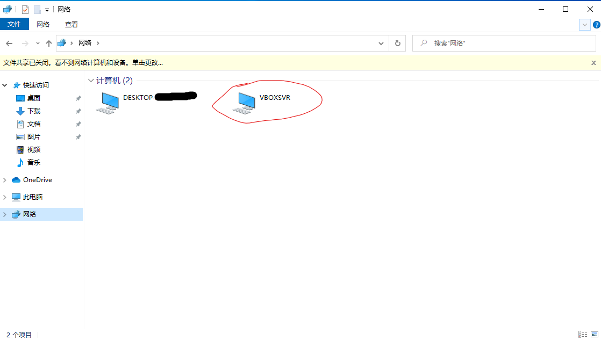
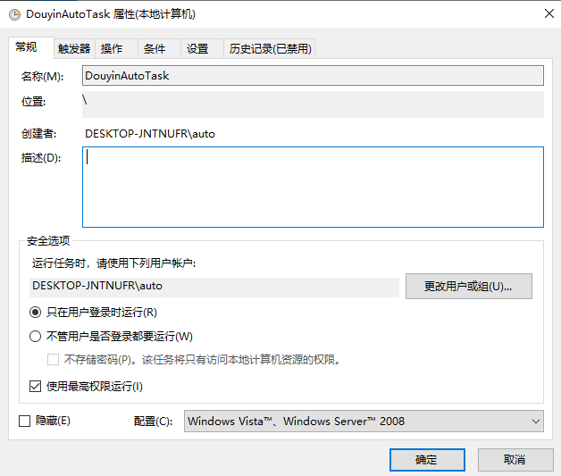

# Douyin/TikTok Auto Liker (自动化点赞助手)

这是一个基于 Python (Playwright + PyAutoGUI) 的自动化工具，用于模拟人工操作进行视频点赞和自动翻页。

## ⚠️ 免责声明 (Disclaimer)

**本项目仅供学习和技术研究使用。**
请勿用于任何商业用途或大规模营销行为。使用本工具产生的任何后果（如账号被风控、封禁等）由使用者自行承担。

## 🛠️ 环境要求

* Windows 10/11
* Python 3.13+
* Edge 浏览器

## ✨ 功能特点

* **模拟人工**：使用 Playwright 接管浏览器，PyAutoGUI 模拟物理点击。
* **智能防封**：随机等待时间，模拟人类观看节奏。
* **KPI 设定**：设定目标点赞数，达成后自动停止并发送通知。
* **颜色识别**：自动判断是否已点赞，避免重复操作。

## 🚀 快速开始
1. 去WxPusher申请你自己的WX_APP_TOKEN和WX_UID
2. 将本项目文件全部拷贝到 VirtualBox 的 win 10 Pro 系统中。如果是拷贝到如图所示的“网络”里，建议将项目文件剪贴到虚拟机的C盘根目录

3. 在 VirtualBox 中浏览器打开https://repo.anaconda.com/miniconda/Miniconda3-latest-Windows-x86_64.exe
4. 下载完成后安装，除了需要勾选"Add Miniconda3 to my PATH environment variable"外，缺省安装。
5. 在 VirtualBox 的miniconda中运行`pip install pyautogui playwright pillow -i https://pypi.tuna.tsinghua.edu.cn/simple`
6. 在 VirtualBox 的miniconda中运行`playwright install chromium`

### 2. 启动浏览器 (调试模式)

本工具需要接管已打开的 Edge 浏览器。请在 CMD 中运行以下命令启动 Edge：

1. 在 VirtualBox 的cmd中运行`start msedge.exe --remote-debugging-port=9222` 

*在 VirtualBox 中使用自动打开的edge登录douyin，并点开到需要点赞的视频。按方向键“下”滑到最后一条。*

### 3. 坐标校准 (关键步骤！)

由于不同电脑的分辨率不同，运行前必须校准“点赞红心”的位置。
在 VirtualBox 的miniconda中cd到与此README文件同目录，运行校准脚本：

```bash
python get_coord.py
```

将鼠标移动到红心中央，记录控制台输出的 `X` 和 `Y` 坐标，并填入 `config.py` 或 `main.py` 中。

### 4. 运行机器人

1. 在真实电脑中cd到与此README文件同目录，运行`python host_listener.py`
2. 在 VirtualBox 的miniconda中cd到与此README文件同目录，运行`python main.py`

### 重复使用

如果上次使用的时候已经完成了上面的这四个步骤，此时你的虚拟机会有运行程序必要的环境，以及浏览器的抖音登录状态。此时可以采用以下的方法来快速运行点赞程序。

1. 在虚拟机中创建“任务计划程序”，名为DouyinAutoTask，确保设置下图所有设置一致。


2. 在Master_Start.bat中修改你的虚拟机的相关信息，包括虚拟机名字、虚拟机用户名、虚拟机登录密码。
3. 双击同目录下的"Master_Start.bat"
4. 切换到虚拟机，点开到需要点赞的视频。按方向键“下”滑到最后一条。
5. 将鼠标准心放在点赞按钮上，放好了之后按下回车键。
6. 设定好KPI，按下回车键，你就可以把虚拟机切换到后台去做你想做的事情了。